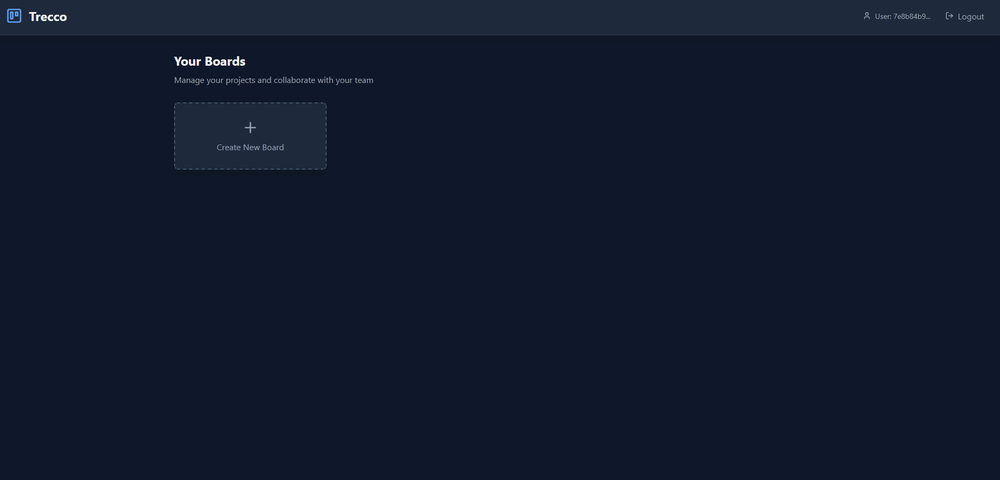

# Trecco Frontend - ReactJS & Tailwind

**Trecco Frontend** is the web interface of the Trello-inspired **Trecco** app. Built with **ReactJS** and **TailwindCSS**.
It was built as a portfolio project to showcase UI/UX design, frontend engineering, and real-time collaboration features.

## Features

* **Boards & Lists**: Organize your work visually with multiple boards and lists.
* **Cards**: Add, edit, move, and delete cards easily.
* **Drag & Drop**: Move cards between lists with a simple drag-and-drop.
* **Real-time Updates**: See changes instantly when other users update the board.



### 🛠 Tech Stack

* **Frontend**: React, Vite, TypeScript, TailwindCSS
* [**Backend API**](https://github.com/L968/trecco-api): .NET 9, MongoDB, SignalR

## Getting Started

### Prerequisites

* [Node.js 20+](https://nodejs.org/) installed
* Backend API running at `https://localhost:7035`

### Install

```bash
git clone https://github.com/L968/trecco-api
cd trecco-api
npm install
```

### Run the App

```bash
npm run dev
```

Open [http://localhost:5173](http://localhost:5173) in your browser to see Trecco in action.

## Real-time Collaboration

Trecco keeps everyone in sync:

* **Move Cards** → Updates instantly when cards are moved.
* **Activity Logs** → See actions from other users in real time.

### Disclaimer

> Trecco is inspired by Trello and was developed only for educational purposes.
It is not affiliated with or endorsed by Trello/Atlassian.

## Contributing

We welcome contributions! Open issues or submit pull requests to improve Trecco.

## License

This project is licensed under the [MIT License](LICENSE.txt).
